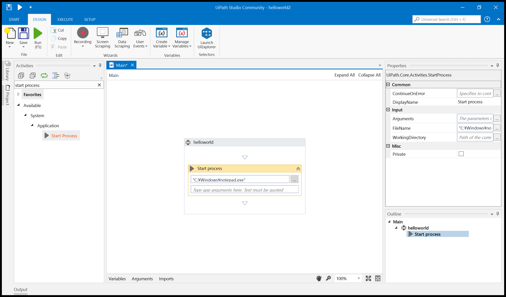
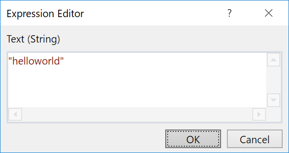
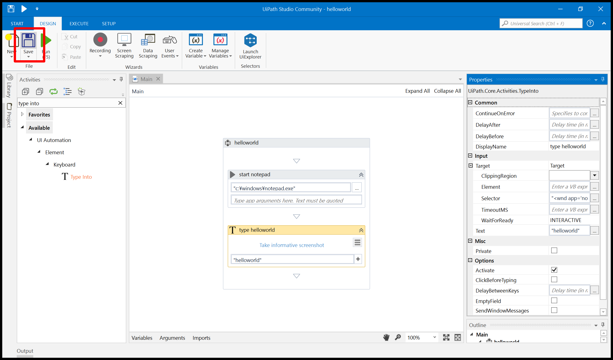
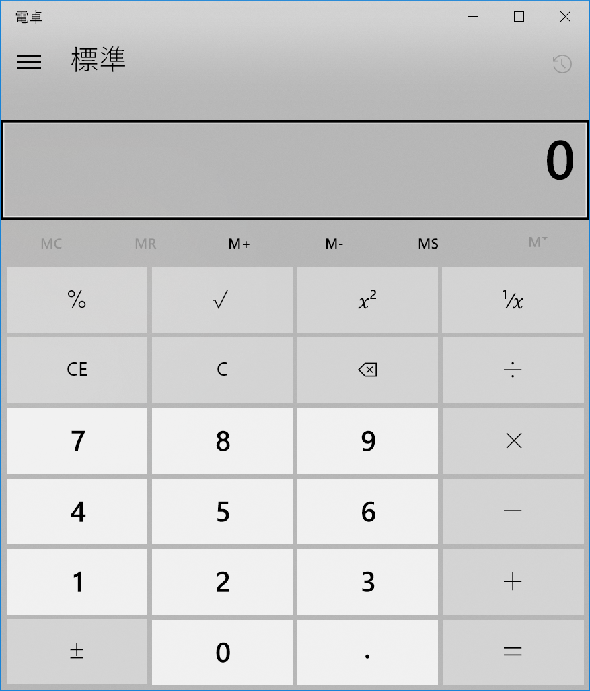

# 🔰UiPath(Community Edition)さわってみた

## 🔰そもそもUiPathって？

[UiPath](https://www.uipath.com/ja/)は[RPA(robotics process automation)](https://ja.wikipedia.org/wiki/%E3%83%AD%E3%83%9C%E3%83%86%E3%82%A3%E3%83%83%E3%82%AF%E3%83%BB%E3%83%97%E3%83%AD%E3%82%BB%E3%82%B9%E3%83%BB%E3%82%AA%E3%83%BC%E3%83%88%E3%83%A1%E3%83%BC%E3%82%B7%E3%83%A7%E3%83%B3)といカテゴリのソフトウェアです。

RPAは人間がPCで行う作業をソフトが理解できる記述内容に落とし込む事によって、ソフトウェア（ロボット）が記述内容に基づいて人間の代わりに作業を行います。  
画像認識等の技術を用いて様々なアプリ、ウィンドウの状態を把握し人間と同様に操作する。　という機能を有数ソフトウェアがRPAと呼ばれているらしい。  
ただRPAと言われる機能を満たしていても、あくまでテストツールと言っているSikulixというOSSが存在したり。  
ここらへんの明確な定義は……ふわっとした感じ？
UiPathはそんなRPAソフトの一つで、[概要ページ](https://www.uipath.com/ja/platform)を見るとUiPath RPA Platformという製品群があるようです。  

UiPath RPA Platformにはの下記の３つがあります。

- UiPath Studio(ロボットの処理を記述したプロジェクトの作成が行える開発環境)
- UiPath Orchestrator(作成した処理パッケージを一元管理する管理環境)
- UiPath Robot(UiPathの実行エージェント)

なお、UiPathStudioにはUiPathRobotが含まれています。

## 🔰UiPath Community Editionって？

UiPathにはCommunityEditionが用意されており、下記ページに利用するための条件が記載されています。(2017年11月05日現在)  
[Free trial or Community](https://www.uipath.com/ja/freetrial-or-community)

>UiPath Community エディション（無償
学術機関、非営利団体、小規模事業者（年間売上100万ドル以下または250台以下のワークステーション環境）なら無償利用可能：

このCommunityEditionではUiPathStudio(CommunityEdition)という開発環境が利用できます。  
(UiPathStudioにはUiPathRobotが含まれているのでこちらも同様に利用できる)

UiPathStudio(CommunityEdition)は作成した処理パッケージ(publish)をUiPathOrchestratorに登録できないといった制限があるようですが、
[Orchestrator Community Edition](https://forum.uipath.com/t/orchestrator-ce/9534)なる代物も最近出てきたようです。

## 🔰UiPathで参考になるドキュメント等

- [UiPathStudioガイド](https://studio.uipath.com/)  
- [UiPathアカデミー](https://www.uipath.com/ja/rpa-academy)
- [UiPathKnowledgeBase](https://www.uipath.com/kb-articles)
- [UiPathForum](https://forum.uipath.com/)

UiPathアカデミーは登録すると無料でRPA開発者向け - 基本トレーニング等が受けられる。

## 🔰CommunityEditionのインストール

>※現在不具合により、本ページトライアルリクエストがご利用いただけません。英語ページでリクエストいただくよう、お願い致します。

上記のように2017年11月5日現在記載されているので英語ページからダウンロードを行う。

- [Free UiPath Community Edition](https://www.uipath.com/freetrial-or-community)

上記ページの**GET COMMUNITY EDITION**を選択。  


必要事項を記載して、**REQUEST COMMUNITY EDITION**を選択。  


登録完了。登録したメールアドレスにダウンロードパスが送られても来ますが、登録完了ページにもダウンロードリンクが記載されているので今回はこちらからダウンロードします。  


ダウンロードしたUiPathStudioSetup.exeを実行してインストール。  


インストール中。  


UIPathStudioが起動するので**Start Free**を選択。  


登録したEmail Addressを入力して**Activate**を選択。  


インストール完了。  


## 🔰notepadを起動してhelloworldとタイプしてみる

ここではnotepadを起動して、Helloworldとタイプする処理を作成してみます。

UiPathStudioを起動した画面で**Blank**を選択  


作成するプロジェクトの情報を入力して**Create**を選択  


UiPathStudioのDESIGN画面が開きます。  


左側のActivitiesパネルからSequenceを選択して、ダブルクリックかドラッグ&ドロップで登録。  
これはシーケンス処理を行う際に利用するオブジェクトです。  


MainパネルにSequenceが登録されました。  


右側にあるPropertiesからプロパティを変更できるのでDisplayNameをhelloworldに変更してみます。  
これでSequenceオブジェクトの表示名が変更されました。  


notepadを起動するのに左側のActivitiesパネルからStartProcessオブジェクトを選択します。  
ツリーの中から探してもいいですし、seachから探す事も出来ます。  
StartProcessはその名の通り、プロセスを開始するオブジェクトです。  


StartProcess登録したら、起動するプロセスを登録します。  
下記赤枠のボタンを押すと選択ダイアログが開きます。  


ダイアログが開いたら`C:\Windows\notepad.exe`を選択。  


StartProcessに起動するアプリが登録されました。  


helloworldとキー入力を行うのに左側のActivitiesパネルからType intoオブジェクトを選択して追加する。  
追加した後に、右側にあるPropertiesパネルのtextの入力ボタンを選択する。  


入力ポップアップが開くので**"helloworld"**と入力して**OK**を選択。  
ダブルコーテーションで括らないと文字列ではなく変数名として認識されるので注意して下さい。  


textに"helloworld"と入力されました。  
ポップアップを開かないで、この小窓に直接入力もできます。  


このままSAVEしてRUNから実行してもnotepadが起動してhelloworldとタイプされて動きますが、今回はselectorを登録してみます。

selectorはUiPathで各処理を実行する対象を選択するもので。  
下記のような形式で記述します。  
`"<wnp app='notepad.exe' cls='Notepad' title='無題 - メモ帳' />"`

- **app**は実行ファイル名
- **cls**はウィンドウクラス名
- **title**はウィンドウタイトル

上記のselectorをType intoオブジェクトのプロパティselectorに記載すると条件に合致するウィンドウを探してType intoが動作します。  
毎回このselectorを手入力で作成するのかというとそうでもなくて。  
現在起動しているウィンドウから自動でselectorを生成してくれるツール(UiExplorer)があります。

**Launch UiExplorer Selectors**を選択。  


UiExplorerを起動すると、現在開いているウィンドウの一覧が出てきます。  


このようにUiExplorerは現在開いているウィンドウのselectorを確認する事ができます。  
今回はnotepadのウィンドウのselectorが知りたいのでnotepadを起動して、**Resetボタン**を選択。  


一覧が更新され、notepadが追加されるかと思います。  
なお下記の画像ではsearch byでappを選択し、アプリケーション名がnotepadに合致する画面のみ表示している例。  


notepad.exeが見つかったら、対象を選択してダブルクリックする。  


下記のように右下にselectorが表示されます。  
このselectorを控えておきます。  


Type intoオブジェクトのプロパティのselector入力ボタンを選択。  


先程控えておいたselectorを入力します。  


Type intoオブジェクトのプロパティDisplayNameにtype helloworldと入力する。  
これでType intoオブジェクトの表示名が変更されました。  


**SAVE**を選択。  


**RUN**を選択。  


実行するとnotepadが立ち上がり、helloworldとタイプされます。
  


## 🔰作成されたProjectを確認してみる。

Project作成時に指定したディレクトを確認してみる。
  


- Main.xaml
- project.json

というファイルが作成されています。

どうやらProjectはxamlとjsonで保存されるようです。

## 🔰publish(nupkgファイル)を生成してみる

UiPathではpublishというnupkgフォーマットのファイルをOrchestratorやrobotに登録して利用する仕組みがあり。  
publishを生成してみます。

UiPathStudioのsetupタブにある**publish**を選択。  


publishファイルが生成され、格納場所が表示されます。  
ちなみにc:\ProgramDataというディレクトリは隠しフォルダです。  


該当ディレクトリを確認するとnupkgファイルが生成されています。  


## 🔰コマンドラインから起動してみる

コミュニティにそのものズバリの投稿があるのでコレを参照して実行してみる。

[Starting ‘UiPath Studio Community’ process using Command LIne](https://forum.uipath.com/t/starting-uipath-studio-community-process-using-command-line/4287)

UiPathRobot.exeに引数fileでxmalファイルを指定すれば動くらしい。

CommunityEditionではUiPathRobotは下記パスに格納されているらしいので確認する。

`C:\Users\userName\AppData\Local\UiPath\app-xx.x.xxxx`

ありました。  


Powershellから下記コマンドを実行。

```PowerShell
C:\Users\userName\AppData\Local\UiPath\app-xx.x.xxxx\UiRobot.exe -file:"C:\UiPath\helloworld\Main.xaml"
```

※userNameとapp-xx.x.xxxxの箇所は各自の環境に合わせて書き換えて下さい。

今回は先程作成した処理を指定したので、notepadが起動してhelloworldとタイプされました。  


## 🔰UiPath Robotから起動してみる

UiPathRobotはコマンドラインからだけでなく、普通に起動してGUIを利用する事もできます。  
UiPathRobot.exeを起動するとタスクトレイに下記のように表示される。  


該当アイコンをクリックすると下記のような画面が表示される。

ここにはpublishが生成された物が表示されるようです。(`C:\ProgramData\UiPath\Packages`をチェックしている模様)  


さきほど生成したhelloworldを選択して**startボタン**から実行。  


実行されました。  


## 🔰コマンドラインからUiPathRobotを起動する際に引数inputを利用してargumentに値を渡す

UiRobot.exeにはinputという引数が存在し、この引数を利用することでUiPath起動時にargumentに値を渡すことができます。

UiRobotの引数input説明
>/i: /input
>A dictionary of input parameters to the workflow, keyed by argument name
Remarks
>The dictionary must be in JSON format and should contain only standard types

今回はinput引数で渡した値をメッセージボックスに表示する処理を作成する。  
まずはinputArgumentというblankのプロジェクト作成する。  


必要事項を入力して**create**を選択。  


Argumentを選択してArgumentパネルを表示する。  


**Create Argument**を選択  


下記のように入力して引数inputvalueを定義する。

| 項目            | 値          |
|---------------|------------|
| Name          | inputValue |
| Direction     | In         |
| Argument Type | String     |
| Default value |            |


左側のActivitiesパネルから**Message Box**を選択して追加  


**Message BoxのプロパティContent**に定義したargument:inputValueを設定する  


**SAVE**を選択  


**RUN**を選択  


引数に何も値を入力していないので、空のメッセージボックが表示されます。  


Uirobot.exeに作成したプロジェクトをinput引数をつけて実行する。

下記コマンドを実行する。

```PowerShell
C:\Users\userName\AppData\Local\UiPath\app-xx.x.xxxx\UiRobot.exe -file:"C:\UiPath\inputArgument\Main.xaml" -input:'{"inputValue":"helloworld"}'
```

※userNameとapp-xx.x.xxxxの箇所は各自の環境に合わせて書き換えて下さい。


input引数で指定した値が宣言してargument:inputValueに代入され、メッセージボックスで表示される事が確認できる。  


## 🔰画像認識で電卓を操作してみる

今回はcalcを起動し、ボタンを画像認識で操作するロボットを作成する。

UiPathStudioを起動した画面で**Blank**を選択  


作成するプロジェクトの情報を入力して**Create**を選択  


Sequenceを登録する。  


Start processを設定し、`"C:\Windows\System32\calc.exe"`を選択する。  


ボタンを画像認識でクリックするために、Click imageオブジェクトを登録する。  


calcを起動する。(次のステップでボタンを押すための画像認識用必要)  


Indicate image on screenを選択する。  
選択すると、画像認識に利用する画像を範囲指定して選択するモードとなります。  
なおこの時にF2キーを押すと、選択するまでのディレイがかかり選択以外の操作が行える用になります。  


下記の図のように電卓の1のボタンを範囲選択します。  


範囲選択した画像が、Click imageに登録されました。  


SAVEを選択。  


RUNを選択。  


電卓が起動し1が入力される事が確認できるかと思います。  


## 🔰総評

UiPathはpublishとしてNugetのパッケージ形式であるnupkgを使ったり、projectの保存にxamlを利用したりとなんかMicrosoft社のオープンな技術を多々利用していた。  
UiPathはルーマニア発のスタートアップでCEOのDaniel Dinesが元Microsoftの人らしいですが。

ともかくオープンな技術を利用していたり、CommunityEditionの存在やアカデミーで無料トレーニングがあったり、フォーラムが存在したりととかなりオープンよりに舵を切っているソフトウェアな印象を受けました。
